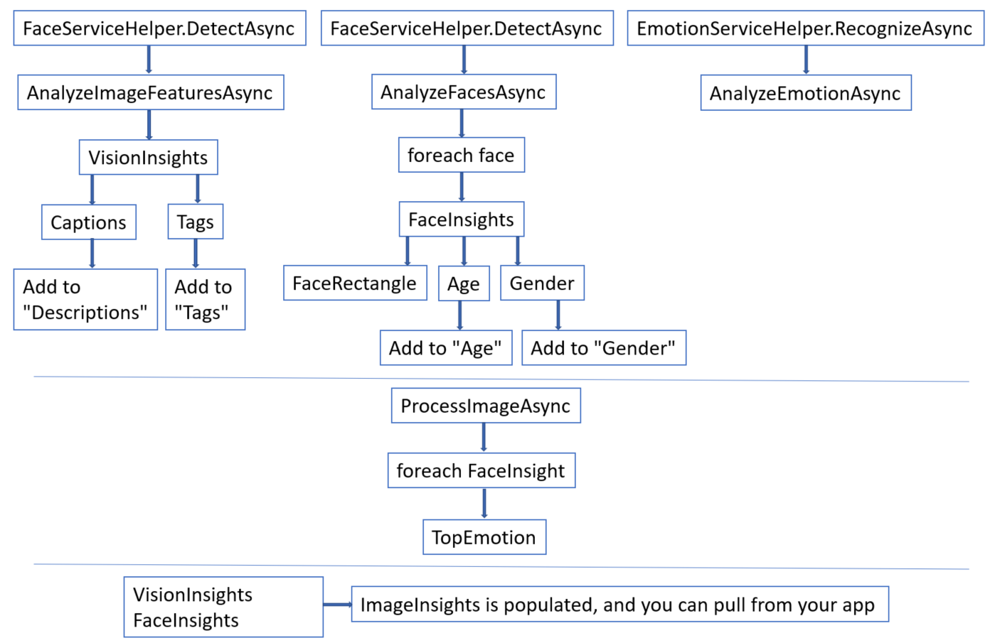

## 2_ImageProcessor
Estimated Time: 30-45 minutes

## Cognitive Services

Cognitive Services can be used to infuse your apps, websites and bots with algorithms to see, hear, speak, understand, and interpret your user needs through natural methods of communication. 

There are five main categories for the available Cognitive Services:
- **Vision**: Image-processing algorithms to identify, caption and moderate your pictures
- **Knowledge**: Map complex information and data in order to solve tasks such as intelligent recommendations and semantic search
- **Language**: Allow your apps to process natural language with pre-built scripts, evaluate sentiment and learn how to recognize what users want
- **Speech**: Convert spoken audio into text, use voice for verification, or add speaker recognition to your app
- **Search**: Add Bing Search APIs to your apps and harness the ability to comb billions of webpages, images, videos, and news with a single API call

You can browse all of the specific APIs in the [Services Directory](https://azure.microsoft.com/en-us/services/cognitive-services/directory/). 

As you may recall, the application we'll be building today will use [Computer Vision](https://www.microsoft.com/cognitive-services/en-us/computer-vision-api) to grab tags and a description, [Face](https://www.microsoft.com/cognitive-services/en-us/face-api) to grab faces and their details from each image, and [Emotion](https://www.microsoft.com/cognitive-services/en-us/emotion-api) to pull emotion scores from each face in the image.

Let's talk about how we're going to call these Cognitive Services in our application.

### **Image Processing Library** ###

Under resources>code>Starting-ImageProcessing, you'll find the `Processing Library`. This is a [Portable Class Library (PCL)](https://docs.microsoft.com/en-us/dotnet/standard/cross-platform/cross-platform-development-with-the-portable-class-library), which helps in building cross-platform apps and libraries quickly and easily. It serves as a wrapper around several services. This specific PCL contains various helper classes for accessing the various Cognitive Services related to Vision and several "Insights" classes to encapsulate the results. Later, we'll create an image processor class that will be responsible for wrapping an image and exposing several methods and properties that act as a bridge to the Cognitive Services. 

After creating the image processor, you should be able to pick up this portable class library and drop it in your other projects that involve Cognitive Services (some modification may be required depending on which Cognitive Services you want to use). 


**Service Helpers**

Service helpers exist to make your life easier when you're developing your app. One of the key things that service helpers do is provide the ability to detect when the API calls return a call-rate-exceeded error and automatically retry the call (after some delay). They also help with bringing in methods, handling exceptions, and handling the keys.

You can find additional service helpers for some of the other Cognitive Services within the [Intelligent Kiosk sample application](https://github.com/Microsoft/Cognitive-Samples-IntelligentKiosk/tree/master/Kiosk/ServiceHelpers). Utilizing these resources makes it easy to add and remove the service helpers in your future projects as needed.


**The "Insights" classes**

Take a look at each of the "Insights" classes:
- If you look at `FaceInsights.cs`, you can see the items we ultimately want from the Face and Emotion APIs: `UniqueFaceID`, `FaceRectangle`, `TopEmotion`, `Gender`, and `Age`
- You can see that in `VisionInsights.cs`, we're calling for `Caption` and `Tags` from the images. 
- Finally, in `ImageInsights.cs`, we're creating our complete Image Insights for each image, with the `ImageId`, `FaceInsights` and `VisionInsights`.

Overall, the "Insights" group only the pieces of information we want from the Cognitive Services.

Now let's take a step back for a minute. It isn't quite as simple as creating "Insights" classes and copying over some methods/error handling from service helpers. We still have to call the API and process the images somewhere. For the purpose of this lab, we are going to walk through creating `ImageProcessor.cs`, but in future projects, feel free to add this class to your PCL and start from there (it may need modification depending what Cognitive Services you are calling and what you are processing - images, text, voice, etc.).

Below, you'll find a flowchart that summarizes how `ImageProcessor.cs` works. There are three levels, the top represents the first set of async tasks, the second represents the second (adding the **TopEmotion** to **FaceInsights** with the help of `AnalyzeFacesAsync` and `AnalyzeEmotionAsync`), and the bottom represents the ultimate result from the processor. At the end of the lab, I recommend reviewing this chart and confirming you understand how `ImageProcessor.cs` works.




### Lab: Creating `ImageProcessor.cs`


Right-click on the solution and select "Build Solution". If you have errors related to `ImageProcessor.cs`, you can ignore them for now, because we are about to address them.

Navigate to `ImageProcessor.cs` within `ImageProcessingLibrary`. 

Add the following code **to the top** of the class, with the other `using` statements:

```
using Microsoft.ProjectOxford.Common.Contract;
using Microsoft.ProjectOxford.Face;
using Microsoft.ProjectOxford.Face.Contract;
using Microsoft.ProjectOxford.Vision;
using ServiceHelpers;
```

[Project Oxford](https://blogs.technet.microsoft.com/machinelearning/tag/project-oxford/) was the project where many Cognitive Services got their start. As you can see, the NuGet Packages were even labeled under Project Oxford. In this scenario, we'll call `Microsoft.ProjectOxford.Common.Contract` for the Emotion API, `Microsoft.ProjectOxford.Face` and `Microsoft.ProjectOxford.Face.Contract` for the Face API, and `Microsoft.Oxford.Vision` for the Computer Vision API. Additionally, we'll reference our service helpers (remember, these will make our lives easier). You'll have to reference different packages depending on which Cogitive Services you're leveraging in your application.

In `ImageProcessor.cs`, under the line `public class ImageProcessor`, we're going to set up some static arrays that we'll fill in throughout the processor. As you can see, these are the main attributes we want to call for `ImageInsights.cs`. Add the code below between the `{ }` of `public class ImageProcessor`:

```
private static FaceAttributeType[] DefaultFaceAttributeTypes = new FaceAttributeType[] { FaceAttributeType.Age, FaceAttributeType.Gender };

private static VisualFeature[] DefaultVisualFeatureTypes = new VisualFeature[] { VisualFeature.Tags, VisualFeature.Description };
```

Immediately underneath the code you have just pasted in, use the code below to create a public task that triggers computer vision, face, and emotion analysis:

```
    public static async Task<ImageInsights> ProcessImageAsync(Func<Task<Stream>> imageStreamCallback, string imageId)
    {
        ImageInsights result = new ImageInsights { ImageId = imageId };

        // trigger computer vision, face and emotion analysis
        List<Emotion> emotionResult = new List<Emotion>();
        await Task.WhenAll(AnalyzeImageFeaturesAsync(imageStreamCallback, result), AnalyzeFacesAsync(imageStreamCallback, result), AnalyzeEmotionAsync(imageStreamCallback, emotionResult));
         
        // eventually we will combine emotion and face results based on face rectangle location/size similarity below

        return result;
    }
```

In the code above, you see that the result of our task is populating ImageInsights. You can also see there is an `await` for three methods: `AnalyzeImageFeaturesAsync`, `AnalyzeFacesAsync` and `AnalyzeEmotionAsync`. Since this public method invokes three other methods, it’s good practice to make those private since they’re not part of the API (at least for this project). Create a `private static async Task` for each. 

> Hint 1: The code for the first one is shown below. The other two are very similar, except `AnalyzeEmotionAsync` will have a different output (which you may be able to glean from the public task you created earlier: `AnalyzeImageFeaturesAsync(imageStreamCallback, result), AnalyzeFacesAsync(imageStreamCallback, result), AnalyzeEmotionAsync(imageStreamCallback, emotionResult)`. 


```
    private static async Task AnalyzeImageFeaturesAsync(Func<Task<Stream>> imageStreamCallback, ImageInsights result)
    {

    }
```

> Hint 2: We use `Func<Task<Stream>>` for each because we want to make sure we can process the image multiple times (once for each service that needs it), so we have a Func that can hand us back a way to get the stream. Since getting a stream is usually an async operation, rather than the Func handing back the stream itself, it hands back a task that allows us to do so in an async fashion.


Let's work on the `AnalyzeImageFeaturesAsync` method first. We'll create a variable called `imageAnalysisResult` that uses `VisionServiceHelper.AnalyzeImageAsync` (service helper making life easier) to analyze the image's features (returns `DefaultVisualFeatureTypes`). Next, we'll output VisionInsights for the image, containing the Caption and Tags. Add the code below to within the `{ }` of your `AnalyzeImageFeaturesAsync` method:

```
    var imageAnalysisResult = await VisionServiceHelper.AnalyzeImageAsync(imageStreamCallback, DefaultVisualFeatureTypes);

        result.VisionInsights = new VisionInsights
            {
                Caption = imageAnalysisResult.Description.Captions[0].Text,
                Tags = imageAnalysisResult.Tags.Select(t => t.Name).ToArray()
            };
```

So now we have the caption and tags that we need from the Computer Vision API, and they're stored in `result.VisionInsights`. 

Next let's add to `AnalyzeFacesAsync` so we can use the Face API to locate the face rectangles (that our app will use to let you filter faces) and the age/gender of the people detected. In the following code, we use the FaceServiceHelper to detect if there are faces in the image. If there are, we want the FaceId and the FaceAttributes (specifically age and gender). Add the code below to within the `{ }` of your `AnalyzeFacesAsync` method:

```
    var faces = await FaceServiceHelper.DetectAsync(imageStreamCallback, returnFaceId: true, returnFaceLandmarks: false, returnFaceAttributes: DefaultFaceAttributeTypes);
```

If there's more than one face, we'll need to make a list of the insights, and then cycle through each. You'll need to determine how we add the `detectedFace` attributes to FaceInsights, as well as how we determine the face ID. Paste this skeleton code (below) immediately below your existing code within the `AnalyzeFacesAsync` method, and fill in the code for `FaceRectangle`, `Age`, `Gender`, and `faceInsights.UniqueFaceId`:

```
    List<FaceInsights> faceInsightsList = new List<FaceInsights>();
    foreach (Face detectedFace in faces)
    {
        FaceInsights faceInsights = new FaceInsights
        {
            FaceRectangle = ,
            Age = ,
            Gender = ,
        };

        SimilarPersistedFace similarPersistedFace = await FaceListManager.FindSimilarPersistedFaceAsync(imageStreamCallback, detectedFace.FaceId, detectedFace);
        if (similarPersistedFace != null)
        {
            faceInsights.UniqueFaceId = ;
        }
            faceInsightsList.Add(faceInsights);
        }

        result.FaceInsights = faceInsightsList.ToArray();
```

> Hints: Remember, in the first part, we're just spelling out what we've already returned (start with `detectedFace.` and use the dropdowns to help). In the second part, determine what the it means if the if statement is true. Turn to a neighbor if you need help.

Note that at the end of the foreach loop, we're adding our insights to the list, and at the very end, we're adding the list of insights to our output result (`result.FaceInsights`).

Next, let's modify `AnalyzeEmotionAsync`. We only need one line of code (service helpers make our lives easier!) to grab all of the face emotions. This code also gives an additional hint for what the output for `AnalyzeEmotionAsync` should be. Add the code below to within the `{ }` of your `AnalyzeEmotionAsync` method:

```
    faceEmotions.AddRange(await EmotionServiceHelper.RecognizeAsync(imageStreamCallback));
```

Note that this doesn't return the TopEmotion that we originally wanted for our FaceInsights (take a look at `FaceInsights.cs`). We don't want to include the scores for each emotion or list all the emotions for everyone. We really just care about the main emotion each face shows. Similar to `AnalyzeFacesAsync`, we will use a foreach loop to find the top emotion and store it in faceInsights. Below what you already have in `ProcessImageAsync` (but above `return result;`), paste in the following skeleton code and in fill in the code for `faceInsights.TopEmotion`:

```
    foreach (var faceInsights in result.FaceInsights)
    {
        Emotion faceEmotion = CoreUtil.FindFaceClosestToRegion(emotionResult, faceInsights.FaceRectangle);
        if (faceEmotion != null)
        {
            faceInsights.TopEmotion = ;
        }
    }
```


> Hint: Figure out what we're doing with the if statement. What do we want to grab `if faceEmotion != null`? 

> Still stuck? Start with `faceEmotion.` and use the dropdowns to help. 

Now that you've built `ImageProcessor.cs`, don't forget to save it! Below, you'll find the flowchart that summarizes how `ImageProcessor.cs` works (again). Does it make more sense now? There are three levels, the top represents the first set of async tasks, the second represents the second (adding the TopEmotion to FaceInsights with the help of `AnalyzeFacesAsync` and `AnalyzeEmotionAsync`), and the bottom represents the ultimate result from the processor.


Want to make sure you set up `ImageProcessor.cs` correctly? You can find the full class [here](./resources/code/classes/ImageProcessor.cs).


### Continue to [3_TestApp](./3_TestApp.md)


Back to [README](./0_readme.md)
